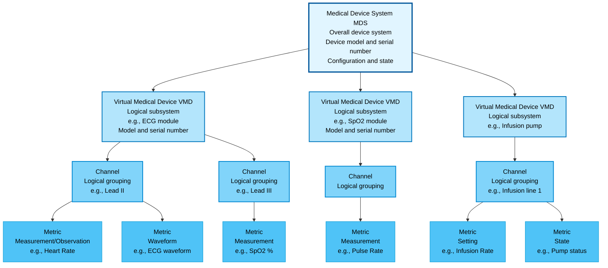

### Overview of communications from complex medical devices

Most Point-of-care devices used by professionals in acute care settings are complex in structure and communicate much more information than is typically reported in a clinical flowsheet display. 

#### The "Flat" Model 
This simplified display represented by an Observation pointing to a single device as its source is sufficient for clinician use when it is desired to emphasize the most important for hour-to-hour and minute-to-minute care of the patient, without overwhelming the user with complexity. For other use cases, more context for how the measurement was made can be important.

#### Device Model for PoCD IG
The backbone for representing a device for this implementation guide is the generic model for a device from the IEEE 11073 Medical Device Communications Domain Information Model.

This is a widely-used standard model, straightforwardly based on a 
hierarchical representation of a typical medical device as an overall system 
with logically distinct subsystems, which in turn have 
additional levels of contained objects.

##### Medical Device System
 
The containment tree is rooted at the overall system, with is identified 
in the model as a Medical Device System (MDS object). representing the whole device, 
with logical subsystems identified as Virtual Medical Devices (VMDs)
 
##### Virtual Medical Devices

These VMD logical subsystems may also have a physical aspect -- they may be
detachable, as in a measurement module in a multi-parameter physiological monitor, so have an individual identity (model and serial number), and may move from MDS to MDS. The tracking of this dynamic relationships is required for the results to be traceable to their precise source.

##### Channels

VMDs may need to have the measurements they report grouped into logical channels. This is sometimes not necessary to model, but in
cases like certain infusion pumps, or EEG modules, there is a meaningful partition of the data into channels that may be critical to the safe treatment of the patient.

##### Metrics
At the lowest level, observations correspond to what the IEEE 11073-10101 Domain Information Model calls a 'Metric'. 
These are not necessarily single quantitative measurements. They may be:
 - enumerations (qualitative or categorical variables, like a "mild - moderate - severe" rating). Enumerations cover text or string-type observations, as well as CodeableConcepts, which allow for coded values with optional human-readable text.
 - or a metric may represent a set of closely related numeric values that are best kept together and recorded as a compound value, as for example, a systolic, diastolic, and mean blood  pressure report at the same time from the same site
 - a metric may also represent a vector of quantities in a segment of a waveform.

##### Representing the Hierarchy in FHIR Profiles

In the PoCD FHIR profiles, the hierarchical containment relationships of the IEEE 11073 model are explicitly represented using the `parent` element in Device and DeviceMetric resources. Each child resource (a VMD Device, a Channel Device, or a DeviceMetric) contains a reference to its parent resource, establishing the containment tree. This parent-child relationship structure allows implementations to traverse the hierarchy and reconstruct the full context of any measurement. For example, a DeviceMetric describing a measurement capability will reference its parent Channel Device. Observations representing the actual measurement values are associated with that DeviceMetric. This explicit representation of the hierarchy ensures that device data is properly contextualized and traceable to its source within the device structure.

##### Attributes may exist at all levels of the tree

An individual measurement has a context made up of all the levels of the containment tree.
At each level there are attributes that condition the understanding of the measurements

An Observation shall link to the DeviceMetric to gain access to all levels of the containment tree. See the "Implementation Guidance" sections of this Implementation Guide for further details.
 
### Value of the MDC Nomenclature model

LOINC and SNOMED nomenclature systems have concept codes for the majority of the most often used device observations, and when they are known for a particular device observation they should certainly made available in such observations.

Why, then, are MDC codes useful, and under what circumstances?
The IEEE 10101-11073 Medical Device Communications Nomenclature standard is driven by a consensus process with input from subject matter experts from the device designer/manufacturer community as well as other clinical and regulatory experts with a goal of expeditiously providing a code for a concept needed in medical device communications as soon as possible, for practical use including device communications testing and research. The code comprehensively supports communicating identity of physiological measurements, from common to somewhat obscure. Of course many of these have LOINC equivalents, SNOMED equivalents, or both and once the correspondences are established, makers of devices and associated software should provided multiple codes for the convenience of
clients preferring any of the systems. 

Besides the physiological measurements, MDC also services the needs of device implementers with a large set of concepts and codes for
communicating 
internal device structure and function including device state, and also event and alert messages connected with technical as well as clinical patient state changes that are 
covered in no other widely used set of standards. The MDC codes for physiological measurements are also used by many manufacturers because of their role in IHE DEC Device Enterprise Communications profiles.
See the "Profiles" pages for examples of the use of the MDC Object Partition codes.

The ongoing nomenclature development process is a collaboration of the IEEE Point-of-Care Device Committee, which ballots and issues updated versions of the standard, and the IHE Patient Care Device Program's Rosetta Terminology Mapping Committee, with representatives of many manufacturers as well as independent experts. The database of record for proposed and provisional, as well as published, concept definitions and codes is currently maintained by the US National Institute of Standards and Technology and is available on the web as the [Rosetta Terminology Mapping Management System](https://rtmms.nist.gov). IEEE permits royalty-free use of the codes and most of the supporting information under conditions described on the RTMMS website and in the FHIR specification ["Using MDC Codes with FHIR"](https://www.hl7.org/fhir/mdc.html)

### Mapping HL7 V2 Device Data to FHIR

The most commonly used form of HL7 Version 2 used in acute-care device data reporting is that of the IHE Device Enterprise Communications profile PCD-01 transaction. That is the basis for the mappings outlined here. Like this Guide, it is based on the IEEE 11073-10201 Medical Device Communications Domain Information Model.

For details see [IHE Patient Care Device (PCD) Technical Framework Volume 2, Transactions](https://www.ihe.net/uploadedFiles/Documents/PCD/IHE_PCD_TF_Vol2.pdf). See also [Mapping from HL7 v2 to FHIR](mappingv2.html) in the Technical Implementation Guidance section.

### Common Use Cases for this Implementation Guide

Use cases in this guide are intended to demonstrate full use of the profiled resources, not only patient-to-observation value reporting. In addition to Observation, exchanges should include device context through Device and DeviceMetric so consuming systems can correctly interpret source, state, and traceability across the containment hierarchy.

Observation-only reporting patterns can omit important non-measurement context and limit interoperability to simple value display. Devices on FHIR enables a broader class of applications by exchanging both measurement data and contextual device content needed for safe handoff, analytics, and advanced workflow support.

Summary: Use cases should support full use of the profiled resources.

#### Data flow from device to clinical flowsheet

Devices are a key part of keeping current situational awareness in treating high-acuity patients. Information not normally provided in the Observation resource may be relevant to care, as, for example, is the device or one of its subsystems or measurements in standby mode or otherwise disabled because of user action. Technical metadata such as battery performance may be valuable for early warning of potential device problems.

The IEEE 11073 family of device specialization standards defines device-specific nomenclature, metrics, and data structures for a broad range of device types. Each specialization standard provides a set of MDC codes and object attributes that translate directly to FHIR resources in this guide:

- **IEEE 11073-10207** (SDC — Service-oriented Device Connectivity): SDC-based devices expose BICEPS descriptors and states that align with the MDS/VMD/Channel hierarchy of this guide; metric descriptors map to DeviceMetric profiles and metric states translate to Observation instances, enabling interoperability between SDC-capable devices and FHIR-based enterprise systems.
- **IEEE 11073-10701** (Hemodynamic monitors): Multi-parameter systems map to a MdsDevice with VMDs per monitoring module and channels per measurement site; waveform outputs (e.g., arterial pressure trace) use SampleArrayDeviceMetric and SampleArrayObservation alongside NumericDeviceMetric for derived values such as systolic, diastolic, and mean pressures.
- **IEEE 11073-10702** (Infusion pumps): Pump identity and line configuration map to MdsDevice and ChannelDevice profiles; infusion rate, volume delivered, and status metrics map to NumericDeviceMetric and EnumerationDeviceMetric with NumericObservation and EnumerationObservation.
- **IEEE 11073-10703** (Implantable cardiac devices, e.g., pacemakers and ICDs): Device identity maps to MdsDevice and VmdDevice profiles; therapy-delivery metrics and sensing channels map to NumericDeviceMetric and ChannelDevice profiles; episode and therapy Observations use NumericObservation or EnumerationObservation.

Future device specializations under development in the IEEE 11073 PoCD family, such as ventilators and dialysis equipment, are expected to follow the same mapping pattern and will be addressable using the profiles defined in this guide once their specialization standards are published.

In each case the MDS/VMD/Channel containment hierarchy defined by the specialization standard maps to MdsDevice → VmdDevice → ChannelDevice parent-link chains in this guide, and MDC nomenclature codes are carried in `Observation.code.coding` and `DeviceMetric.type.coding`. Extensions such as operating-mode, metric-availability, and technical-range carry device-state and measurement-qualification information that the specialization standards expose at the metric level.

#### Clinical and technical data archiving and retrospective data feed

It is expected that some institutions will choose to set up an archival system saving all available detail from devices as well as other data created in near real time, such as  provider notes during a procedure, including device data and context details that may not be displayed in real time. Assuming that there is such an archive system, the ability to retrieve and "look back on" all such data on request of a person or of another hospital information system can serve many use cases, including those listed. Since FHIR seems to be becoming a common interoperability medium or "lingua franca" for passing around models to retrieve data retrospectively. The strong support for search and filtering designed into FHIR are highly valuable in such uses.

#### Clinical decision support

This Implementation Guide does not define clinical decision support (CDS) rules or algorithm logic. Its direct contribution to CDS is the standardized representation of device context needed by CDS engines to interpret observations safely and correctly.

Specifically, this guide enables applications to link an Observation to its DeviceMetric and traverse parent relationships to Channel, VMD, and MDS FHIR Device resources. That context can provide measurement method, module identity (for plug-in devices), device configuration/state, and related technical qualifiers that may affect rule behavior. In other words, the CDS implementation is external to this guide, but the data elements defined here provide the traceable inputs that CDS workflows rely on.

#### Clinical analytics

Comprehensive recording of device configuration and state information in addition to the measurements recorded supports including more kinds of information in analytics models.

For this use case, implementations can combine Observation profiles such as NumericObservation, CompoundNumericObservation, EnumerationObservation, and SampleArrayObservation with the corresponding DeviceMetric profiles (NumericDeviceMetric, EnumerationDeviceMetric, and SampleArrayDeviceMetric) and Device hierarchy profiles (MdsDevice, VmdDevice, and ChannelDevice). This profile set allows analytics pipelines to evaluate not only measured values, but also device-context relationships through parent links.

Analytics can be further enriched using PoCD extensions that carry technical and operational qualifiers, for example metric-availability, technical-range, reference-range, resolution, operating-mode, operating-hours, operating-cycles, sweep-speed, and visual-grid. These elements help distinguish clinically meaningful variation from device configuration or operating-state effects, improving retrospective analysis quality.

#### Clinical engineering and technology management analytics

In this scenario, comprehensive device configuration and state information supports both real-time monitoring and retrospective analysis for the many devices tracked by clinical engineering and healthcare technology management teams. Devices communicate much of this directly, including power-up self-test results, calibrations performed, operational state history, and location.

This use case uses Device hierarchy profiles (MdsDevice, VmdDevice, and ChannelDevice) with DeviceMetric profiles (NumericDeviceMetric, EnumerationDeviceMetric, and SampleArrayDeviceMetric) to track subsystem relationships, metric capabilities, and operational changes over time. Relevant PoCD extensions include operating-mode, operating-hours, operating-cycles, metric-availability, technical-range, resolution, sweep-speed, and visual-grid.

#### Adverse event analysis
When it is necessary to investigate an adverse event, the context information provided by thorough archiving of all background information about the state and performance of the device allows, for example, identification of specific subsystems and components of the device may have malfunctioned.

For adverse event investigations, linking Observation to DeviceMetric and then through parent relationships to ChannelDevice, VmdDevice, and MdsDevice helps localize where in the device hierarchy an issue occurred. Extensions such as metric-availability, reference-range, technical-range, resolution, and operating-mode provide evidence about metric validity, expected limits, and device operating context at the time of the event.

#### Research data feed

A key characteristic of research uses of data is the need to be able to summon up the data needed to answer unanticipated questions that are raised.

A longitudinal FHIR-based archive supports this by preserving both measurements and device context so analyses can be reproduced and reinterpreted as new hypotheses emerge. Research workflows can query Observation together with DeviceMetric and Device hierarchy resources (MDS, VMD, and Channel levels) to keep traceability to subsystem and metric definitions and improve comparability across units, institutions, and time periods.

Research datasets can be further enriched with PoCD extensions such as metric-availability, technical-range, reference-range, resolution, operating-mode, operating-hours, operating-cycles, sweep-speed, and visual-grid. These qualifiers help distinguish physiologic variation from differences in device configuration, operating state, or acquisition conditions.

#### Inter-facility transfer continuity for critically ill but stable patients

When a patient in critical but stable condition must be transferred to a more equipped or specialized health facility, baseline monitoring before transfer, monitoring during transport, and monitoring after arrival can all be part of one continuous care journey. FHIR-based access to contextual device information together with produced measurement data enables continuity across these phases and supports safer handoffs between teams and facilities.

In this exchange pattern, Observation resources carry the measured values and trends, DeviceMetric resources describe the specific metrics and their constraints, and Device resources provide the hierarchical context (MDS, VMD, and Channel parent relationships). Where applicable, Patient and Practitioner resources identify care context, and CapabilityStatement resources can support onboarding between sending and receiving systems by documenting supported interactions and profiles.

#### Ambulatory clinic integration with reduced infrastructure cost

Ambulatory clinics that already have EMR integration in place can reduce implementation cost by using FHIR-based transport for device data exchange, avoiding the need to deploy additional proprietary integration systems and network infrastructure.

Clinics can exchange Observation, DeviceMetric, and Device resources directly with existing EMR/FHIR endpoints so that measurements and device context are integrated without a separate middleware stack. Vocabulary alignment can be supported using ValueSet and CodeSystem artifacts defined by this guide, while endpoint behavior and conformance expectations can be coordinated through CapabilityStatement exchange.

** The following use cases are not in this release of the Implementation Guide but are intended to be covered in the next release**

#### Alerting a person
Devices report a rich variety of clinical and technical alerts that may require prompt or immediate action by members of the clinical care and technical teams. Current proprietary systems, and systems using the Alert Communications Management (ACM) HL7 V2 Profile serve this sector. As FHIR broadens its coverage of hospital needs, this should be supported.

#### Alerting another system

Events from one device system to another, or to other clinical information systems,play a role in important use cases, such as are seen in the IHE PCD infusion verification profile.

### Information for implementers of applications consuming PoCD FHIR data
Some of the details in this Guide are mainly of concern to implementers of device and device gateway software and is not of primary importance to users of the data.

For implementers of systems consuming rather than constructing
FHIR resource representations, the important aspects of the Guide
to pay attention to are the point that Observations are
embedded in a containment structure of different levels of logical organization, discoverable by following links between Device resources, each carrying information about 
one logical containment level of the ultimate Observation.

Implementers of such applications may already be familiar with the IHE Device Enterprise Communications profiles, and Data Observation Reporter transactions such as PCD-01, and can leverage their knowledge of the IEEE 11073 Domain Information Model to help in understanding the FHIR forms of 
this Implementation Guide. The "Implementation Guidance" page "Mapping HL7 V2 to FHIR" may be helpful.

### Information for implementers of applications providing PoCD FHIR data

#### Using existing device model
Implementers working with data from devices designed with the IEEE 11073 Domain Information Model in mind, or with existing IHE PCD-01 capabilities, may find it relatively easy to use this as a basic template for constructing
FHIR representations in this Implementation Guide

#### Building a device model

If no compatible model for a device exists, consider the following steps:

In collaboration with subject matter experts in the functions of the device and in the clinical uses of the device data, gather information on what the device can communicate and how it maps to the needs of:
- clinical users
  - clinicians who will use the data for current awareness
  - analysts who will use the information for reports and for archiving 

- non-clinical users
  - clinical engineers, biomedical engineers and healthcare technology managers 

not neglecting the non-clinical information that the device can communicate about, devise a containment tree that represents the devices capabilities and their logical arrangement.

#### Analyze the form in which the device makes the data available 

If this is a "green field" project for a device that is in the design phase, consider the range of uses for the device

It is probably more common that you are retrofitting FHIR output to a device that already has a legacy form of data output and you 
must fit a "gateway" to convert data in a form the device
already uses to a form compatible with a "containment tree".

#### Translating to FHIR resources
See especially the "Implementation Guidance", "Profiles", and "Terminology"
sections of this Implementation Guide for needed details.
